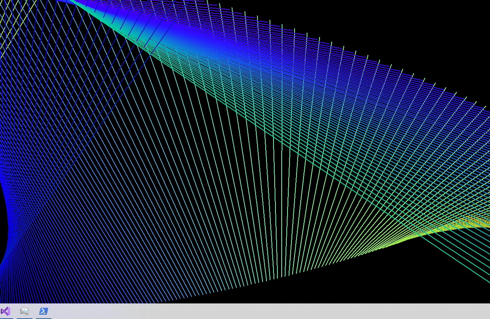

# Desktop Draw

Example of an application that draws the background in real-time

This code sample is in eternal debt to Gerald Degeneve and his [post at `codeproject.com`](https://www.codeproject.com/Articles/856020/Draw-Behind-Desktop-Icons-in-Windows-plus)

Only tested on Windows 10, but should work on Windows 8 too, according to the post above.

Crop of final result:

The result is animated and random.

## Build

I have only tried to build this with Visual Studio. I have had a few issues with compiling for different target configurations, but that may be because I'm bad at building with Visual Studio. The configuration I use for building is Release x86.

## Usage

To use as default background (that is - replace what would normally be your default bacground): Put the executable (or a shortcut to it) in the startup folder, which can be found with `Win`+`R` and then typing `shell:startup`